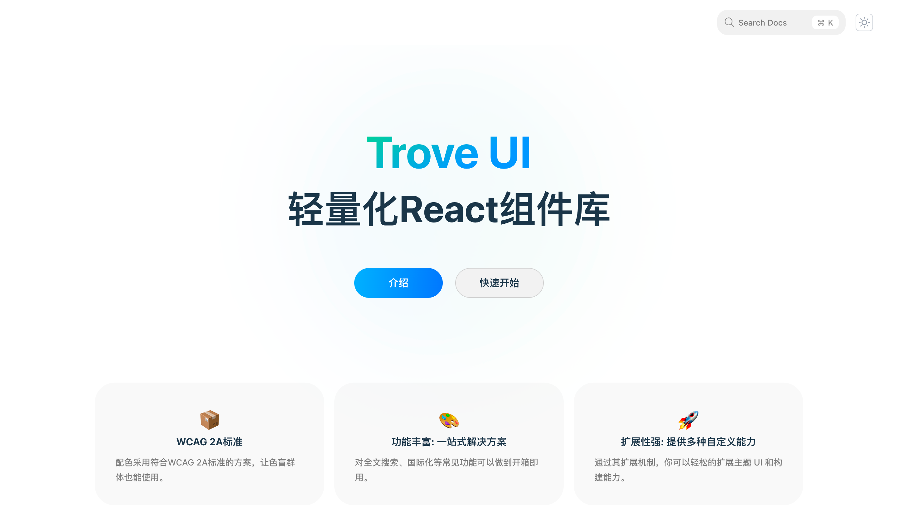

# Trove UI



> 基于React的现代UI组件库，提供优雅、高效且可定制的界面解决方案。
>
> ⚠️ **注意**：本项目仍处于初始开发阶段，请勿用于生产环境。

## 目录

- [环境准备](#环境准备)
- [快速开始](#快速开始)
- [参与开发](#参与开发)
- [项目结构](#项目结构)
- [开发规范](#开发规范)
- [常见问题](#常见问题)

## 环境准备

### Node.js

确保您的开发环境安装了正确版本的 Node.js：

- **要求版本**：`v22.11.0`
- **推荐工具**：使用 `nvm` 进行 Node.js 版本管理

#### 使用 nvm 安装 Node.js

1. 下载并安装 [nvm for Windows](https://github.com/coreybutler/nvm-windows/releases) 或在 Linux/macOS 上安装 [nvm](https://github.com/nvm-sh/nvm)

2. 安装指定版本的 Node.js：

```bash
nvm install 22
nvm use 22
```

3. 验证安装：

```bash
node -v
# 应显示 v22.11.0
```

### 包管理工具

本项目使用 `pnpm` 作为包管理工具：

- **要求版本**：`10.6.5`

#### 安装 pnpm

```bash
npm install -g pnpm@10.6.5
```

#### 验证安装

```bash
pnpm -v
# 应显示 10.6.5
```

## 快速开始

### 1. 克隆仓库

```bash
git clone https://github.com/zijian-feng/t-design.git
cd t-design
```

### 2. 安装依赖

⚠️ **重要**：强烈建议使用 `pnpm` 安装依赖，以确保依赖树的一致性。

```bash
pnpm install
```

### 3. 启动开发服务器

```bash
pnpm dev
```

成功启动后，您可以在浏览器中访问 [http://localhost:3000](http://localhost:3000) 查看组件库文档和示例。

## 参与开发

我们欢迎社区贡献者参与 T Design 的开发。请按照以下步骤加入我们：

1. **获取访问权限**：通过电子邮件联系项目维护者获取 Lark（飞书）工作空间的邀请
2. **了解开发规范**：在 Lark 文档中查看完整的项目开发规范和贡献指南
3. **认领任务**：查看项目 Issues 或 Lark 上的任务看板，选择您想要解决的问题
4. **提交 PR**：完成开发后提交 Pull Request，我们的团队将及时审核

### 为什么需要加入 Lark？

- 访问详细的开发规范和设计文档
- 实时参与团队讨论和决策
- 获得 PR 的及时反馈和处理
- 与核心团队成员直接交流，解决技术问题

## 项目结构

```
t-design/
├── components/       # UI组件源码
├── docs/             # 文档和示例
├── public/         # 静态资源
├── scripts/          # 构建和开发脚本
├── styles/           # 全局样式和主题配置
├── config/            # 配置文件
├── shell/         # 自动化脚本
├── src/            # 开发目录
└── package.json      # 项目配置
```

## 开发规范

详细的开发规范请参阅 Lark 工作空间中的文档。主要包括：

- 组件设计原则
- 代码风格和提交规范
- 测试要求
- 文档编写指南

## 常见问题

**Q: 我可以使用 npm 或 yarn 代替 pnpm 吗？**

A: 不建议使用其他包管理工具，这可能导致依赖不一致问题。项目配置已针对 pnpm 优化。

**Q: 如何参与组件库的设计讨论？**

A: 加入我们的 Lark 工作空间后，您可以在专门的讨论频道中提出建议和参与设计决策。

---

© 2025 T Design Team. All Rights Reserved.
